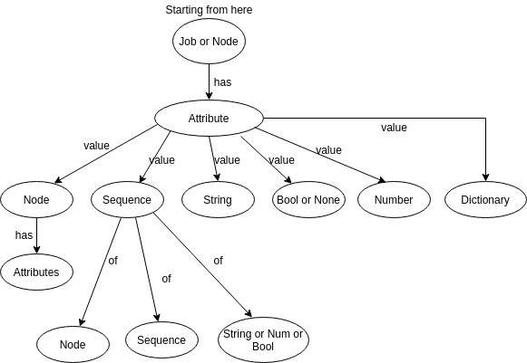

# Challenge for Ganga projects in GSoC 2020

The challenge contains three parts:

1) First part demonstrates a basic job in Ganga and work with python
2) Second part shows the demonstration of working with a model database from python.
3) Third part is specific to the GUI project where you will be required to create a webserver that can demonstrate its interaction with Ganga in a simple manner.

## Setup
Following the steps below will ensure the proper working of this project.


```bash
virtualenv -p python3 GSoC
cd GSoC/
. bin/activate
pip install -e git+https://github.com/RajatSingh95/GangaGSoC2020#egg=gangagsoc
cd src/gangagsoc
```
## Project Sructure
Now, you are in the project root directory. So in order to run respective task, follow these steps:


For running the Ganga Initial Task, change the diectory to gangagsoc/Initial_Task
```bash
cd gangagsoc/Initial_Task
```

For running the Ganga Persistent Storage Task, change the diectory to gangagsoc/Persistent_Storage_Task
```bash
cd gangagsoc/Persistent_Storage_Task
```

For running the Ganga GUI task, change the diectory to gangagsoc/GUI_Task
```bash
cd gangagsoc/GUI_Task
```

To run testcases for all the tasks( For Initial and Persistent Storage),from project root directory run the command as follow:

```bash
python -m unittest discover test "*.py"
```

For GUI task, unit test has to run separately which is mentioned in GUI Task instructions.


## Ganga initial task

Once you entered Initial_Task direcory,

run
```bash
ganga -i subtask_1.py
```
to execute first subtask

Similarly, run
```bash
ganga -i subtask_2.py
```
to execute second subtask


## Ganga persistent storage task

Once you entered Persistent_Storage_Task directory, setup the database server first. In order to do so, run

---
*For normal installation, follow the commands below:*

```bash
chmod +x setup_db_server.sh
./setup_db_server.sh
```
This will install mysql server with database and table for our purpose on pc. You’ll be prompted to create a root password during the installation. Choose a one and make sure you remember it, because you’ll need it later. 
You can press Y and then ENTER to accept the defaults for all the subsequent questions, with the exception of the one that asks if you’d like to change the root password.


*For docker user, run the commands below for installation:*

```bash
docker pull mysql:latest
docker run --name=user_mysql_1 --env="MYSQL_ROOT_PASSWORD=root_password" -p 3306:3306 -d mysql:latest
docker exec -i user_mysql_1 mysql -uroot -proot_password < schema.sql

```

---
*Note: all the commands should be run in Persistent_Storage_Task directory*

This will also create a database named as `job` with a table `data`
After the mysql-server installation, 

run
```bash
python subtask_1.py
```
to execute first subtask

This will write the blob of job string into the database and read it back.

run
```bash
python subtask_2.py
```
to execute second subtask

Explanation:

Below is the approach used to convert/parse Job string blob back to Job object



and similarly, run
```bash
python subtask_3.py
```
to execute third subtask

This will show performance of thousand iteration i.e (total time taken/no. of iteration) and time taken separately to recreate a Job object.
This process takes some time like 3-4 minutes for 1000 iterations.

Below is the preview of how output looks.
```bash
-------Ran  1000 iterations: took  245.27705764770508 seconds-----------
-------Performance:  0.24527705764770508 seconds-----------

-------Time for reading a Job string blob from db: 0.0010089874267578125  seconds------
-------Time for creating a Job object: 0.09965062141418457  seconds-------

```


## Ganga GUI task
---
Once you entered GUI_Task directory, run the following commands to create a django webserver:

```bash
python manage.py makemigrations task
python manage.py migrate
python manage.py loaddata countries.json cities.json
python manage.py runserver 8000
```

This will create a webserver on http://127.0.0.1:8000

1) so, in order to check first subtask,

visit http://127.0.0.1:8000/task/subtask1 on your web browser.

The web page will show you countries population on a bar graph in descending order. Whenever you click on any country bar in graph, a pie chart will appear with most populated cities in selected Country.

2) to check second subtask,

visit http://127.0.0.1:8000/task/subtask2 on your web browser.

The web page will show a button with Submit Job button. When you click on it, it will show you Submitted Job id. And at the same time, you can see the job status below on three step button with intuitive loader if the job is in process of transition from one state to another.


To run unit test for GUI Task, run
```bash
python manage.py test
```

